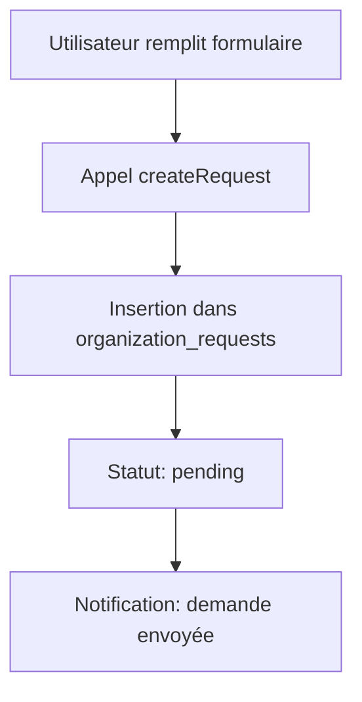
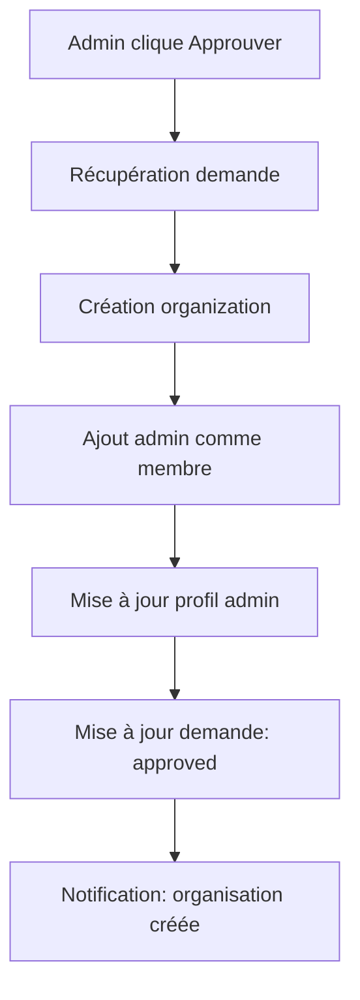
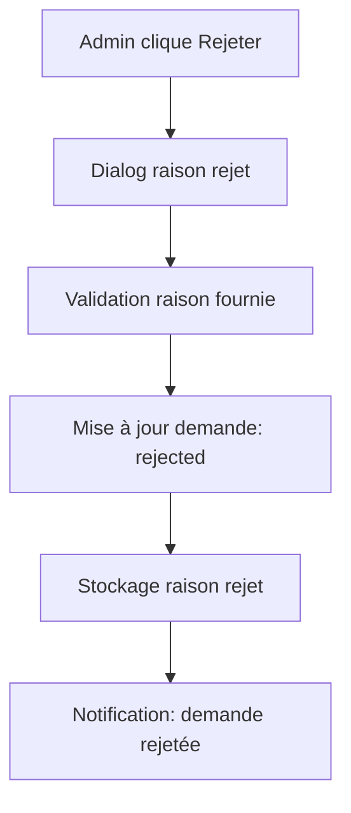

# Guide du Backoffice Admin - Validation des Organisations

## 🎯 Vue d'ensemble

Le système B2B de Savistas AI-Cademy intègre désormais un **système de validation des demandes d'organisation** contrôlé par un administrateur unique : **contact.savistas@gmail.com**.

Lorsqu'une école ou une entreprise souhaite créer son organisation, une **demande** est créée et mise en attente de validation. L'admin Savistas peut alors approuver ou rejeter cette demande depuis un backoffice dédié.

---

## 🔐 Accès Admin

**Seul le compte `contact.savistas@gmail.com` a accès au backoffice.**

### URL du backoffice :
```
/admin/organization-requests
```

### Sécurité :
- Les RLS policies Supabase vérifient l'email de l'utilisateur connecté via `auth.jwt() ->> 'email'`
- Si un utilisateur non autorisé tente d'accéder, il sera automatiquement redirigé vers `/dashboard`

---

## 📋 Flux de création d'organisation

### 1️⃣ **Demande de création**

Quand un utilisateur avec le rôle `school` ou `company` souhaite créer son organisation :

1. Il remplit le formulaire `OrganizationProfileForm` avec :
   - **Informations personnelles** (admin de l'organisation) :
     - Nom complet
     - Date de naissance
     - Numéro de téléphone
     - Pays
     - Ville (optionnel)

   - **Informations de l'organisation** :
     - Nom de l'organisation
     - Description
     - Site web
     - Type (école ou entreprise)

2. Au lieu de créer directement une organisation, une **demande** est enregistrée dans la table `organization_requests` avec le statut `pending`

3. L'utilisateur voit un message :
   > "Votre demande de création d'organisation a été envoyée avec succès. Elle sera examinée par un administrateur Savistas."

### 2️⃣ **Validation par l'admin**

L'admin Savistas se connecte avec `contact.savistas@gmail.com` et accède à `/admin/organization-requests` :

#### Vue du dashboard admin :
- **Statistiques** :
  - Total des demandes
  - En attente
  - Approuvées
  - Rejetées

- **Onglets** :
  - **En attente** : Demandes nécessitant une action
  - **Approuvées** : Demandes validées (lecture seule)
  - **Rejetées** : Demandes refusées (lecture seule)

#### Pour chaque demande, l'admin voit :
- Nom de l'organisation
- Type (école / entreprise)
- Description
- Site web
- Informations de l'administrateur (nom, email, téléphone, pays, ville, date de naissance)
- Date de création de la demande

#### Actions possibles :
1. **Approuver** :
   - Crée automatiquement l'organisation dans la table `organizations`
   - Met à jour le profil de l'admin de l'organisation
   - Ajoute l'admin comme membre actif avec le rôle `admin`
   - Met à jour la demande avec le statut `approved`
   - Stocke l'ID de l'organisation créée dans `created_organization_id`

2. **Rejeter** :
   - Demande une raison de rejet (obligatoire)
   - Met à jour la demande avec le statut `rejected`
   - Stocke la raison dans `rejection_reason`

### 3️⃣ **Après validation**

#### Si approuvée :
- L'organisation est créée avec `validation_status: 'approved'`
- L'admin de l'organisation peut accéder à son dashboard d'organisation
- Il peut inviter des membres, gérer son code d'organisation, etc.

#### Si rejetée :
- L'utilisateur voit un message lui indiquant que sa demande a été refusée
- La raison du rejet peut être consultée (future notification par email)

---

## 🗄️ Structure de la base de données

### Table `organization_requests`

```sql
CREATE TABLE organization_requests (
  id uuid PRIMARY KEY,

  -- Informations de l'organisation demandée
  organization_name text NOT NULL,
  organization_description text NOT NULL,
  organization_website text NOT NULL,
  organization_type text ('school' | 'company'),

  -- Informations de l'administrateur
  created_by uuid REFERENCES auth.users(id),
  admin_full_name text NOT NULL,
  admin_date_of_birth date NOT NULL,
  admin_phone text NOT NULL,
  admin_country text NOT NULL,
  admin_city text,
  admin_email text NOT NULL,

  -- Statut et traitement
  status text ('pending' | 'approved' | 'rejected') DEFAULT 'pending',
  reviewed_at timestamp,
  reviewed_by uuid REFERENCES auth.users(id),
  rejection_reason text,
  created_organization_id uuid REFERENCES organizations(id),

  -- Timestamps
  created_at timestamp DEFAULT now(),
  updated_at timestamp DEFAULT now()
);
```

### Colonnes ajoutées à `organizations`

```sql
ALTER TABLE organizations
ADD COLUMN validation_status text ('pending' | 'approved' | 'rejected') DEFAULT 'pending',
ADD COLUMN validated_at timestamp,
ADD COLUMN validated_by uuid REFERENCES auth.users(id),
ADD COLUMN website text;
```

### Rôle `admin` ajouté à `organization_members`

```sql
ALTER TABLE organization_members
DROP CONSTRAINT organization_members_role_check,
ADD CONSTRAINT organization_members_role_check
  CHECK (role IN ('student', 'parent', 'professor', 'admin'));
```

---

## 🧩 Architecture technique

### Hooks créés

#### `useAdminAccess.ts`
Vérifie si l'utilisateur connecté est `contact.savistas@gmail.com`.

```typescript
const { isAdmin, loading, adminEmail } = useAdminAccess();
```

#### `useOrganizationRequests.ts`
Gère les demandes d'organisation (CRUD + approbation/rejet).

```typescript
const {
  requests,
  pendingRequests,
  approvedRequests,
  rejectedRequests,
  loading,
  createRequest,
  approveRequest,
  rejectRequest,
  refetch
} = useOrganizationRequests(adminMode);
```

**Méthodes principales :**
- `createRequest(data)` : Crée une nouvelle demande
- `approveRequest(requestId)` : Approuve une demande et crée l'organisation
- `rejectRequest(requestId, reason)` : Rejette une demande avec une raison

### Composants créés

#### `AdminOrganizationRequests.tsx` (Page)
Dashboard admin pour gérer les demandes.
- Route : `/admin/organization-requests`
- Protégé par `ProtectedRoute` et vérification email

#### `OrganizationRequestCard.tsx` (Composant)
Carte d'affichage d'une demande avec actions d'approbation/rejet.

### Modifications apportées

#### `OrganizationProfileForm.tsx`
- Modifié pour créer une **demande** (`organization_requests`) au lieu d'une organisation directement
- Utilise `useOrganizationRequests().createRequest()`

#### `App.tsx`
- Ajout de la route `/admin/organization-requests`

---

## 📊 Workflows

### Workflow 1 : Création de demande



### Workflow 2 : Approbation



### Workflow 3 : Rejet



---

## 🎨 Interface utilisateur

### Dashboard Admin

**Sections :**
1. **Header** : Logo Savistas + titre "Backoffice Admin"
2. **Statistiques** : 4 cartes (Total, En attente, Approuvées, Rejetées)
3. **Onglets** : 3 onglets pour filtrer par statut
4. **Liste des demandes** : Cartes avec toutes les informations et actions

**Actions sur une demande en attente :**
- Bouton vert **"Approuver"** avec icône CheckCircle2
- Bouton rouge **"Rejeter"** avec icône XCircle
  - Ouvre un dialog pour saisir la raison du rejet

**Demandes approuvées/rejetées :**
- Lecture seule
- Badge de statut coloré
- Date de traitement affichée
- Raison du rejet affichée (si applicable)

---

## 🔍 Tests recommandés

### Test 1 : Création de demande
1. Se connecter avec un compte `school` ou `company`
2. Accéder au formulaire de création d'organisation
3. Remplir tous les champs
4. Soumettre
5. ✅ Vérifier que la demande apparaît dans `organization_requests` avec `status: 'pending'`

### Test 2 : Accès backoffice
1. Se connecter avec `contact.savistas@gmail.com`
2. Accéder à `/admin/organization-requests`
3. ✅ Vérifier l'affichage du dashboard et des demandes en attente

### Test 3 : Approbation
1. Dans le backoffice, cliquer sur "Approuver" pour une demande
2. ✅ Vérifier la création de l'organisation dans `organizations`
3. ✅ Vérifier l'ajout du membre admin dans `organization_members`
4. ✅ Vérifier la mise à jour de la demande (`status: 'approved'`)

### Test 4 : Rejet
1. Dans le backoffice, cliquer sur "Rejeter" pour une demande
2. Saisir une raison
3. Confirmer
4. ✅ Vérifier la mise à jour de la demande (`status: 'rejected'`)
5. ✅ Vérifier que la raison est stockée dans `rejection_reason`

### Test 5 : Sécurité
1. Se connecter avec un compte non-admin
2. Tenter d'accéder à `/admin/organization-requests`
3. ✅ Vérifier la redirection vers `/dashboard`
4. ✅ Vérifier qu'aucune donnée n'est retournée par l'API

---

## 🚀 Prochaines étapes (optionnel)

1. **Notifications email** :
   - Email de confirmation lors de la création de demande
   - Email de validation/rejet de la demande

2. **Système de commentaires** :
   - Permettre à l'admin de laisser des commentaires sur les demandes

3. **Filtres et recherche** :
   - Recherche par nom d'organisation
   - Filtres par type (école/entreprise)
   - Tri par date

4. **Statistiques avancées** :
   - Graphiques d'évolution des demandes
   - Temps moyen de traitement
   - Taux d'approbation

5. **Multi-admin** :
   - Permettre à plusieurs admins de valider
   - Système de permissions

---

## 📝 Migrations appliquées

### 20251023141125_add_validation_fields_to_organizations.sql
Ajoute les colonnes `validation_status`, `validated_at`, `validated_by`, `website` à `organizations`.

### 20251023141255_fix_organization_members_role_constraint.sql
Ajoute le rôle `admin` à la contrainte CHECK de `organization_members`.

### 20251023141313_create_organization_requests_table.sql
Crée la table `organization_requests` avec RLS policies et indexes.

---

## 🎉 Résumé

Le système de validation admin est maintenant **100% opérationnel** :

✅ Les organisations ne sont plus créées directement
✅ Les demandes passent par une validation admin
✅ Seul `contact.savistas@gmail.com` peut valider
✅ Interface backoffice complète et intuitive
✅ Sécurité assurée par RLS policies
✅ Aucune erreur TypeScript
✅ Migrations appliquées en production

**Le système B2B est maintenant complet et sécurisé !** 🚀
